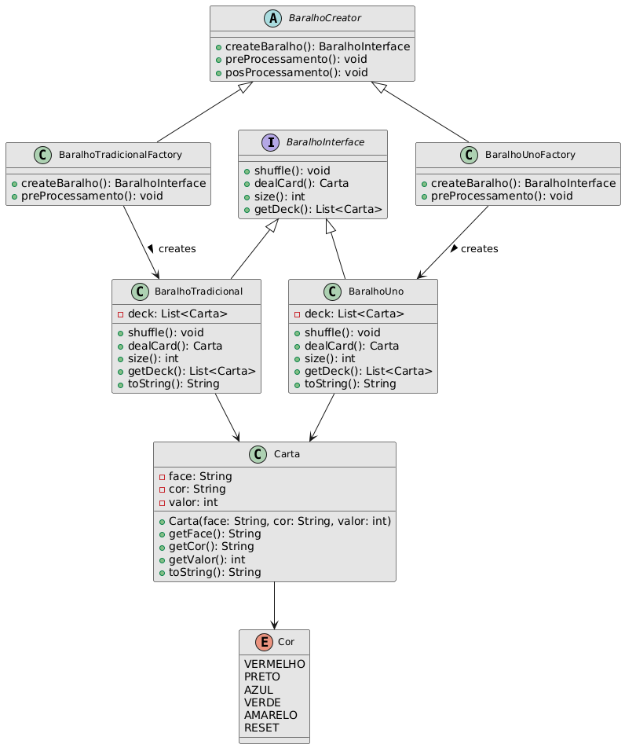

# Projeto de Baralho com Padrão Factory Method
### Padrões de Projeto de Software - Colaborativa 02

# Introdução 
Neste projeto, foi implementado o padrão de projeto Factory Method para a criação de diferentes tipos de baralhos: um baralho tradicional e um baralho de Uno. O objetivo foi organizar a lógica de criação dos objetos de forma mais escalável e flexível, seguindo as boas práticas de design de software. O Factory Method é um padrão de criação que define uma interface para criar um objeto, mas permite que as subclasses alterem o tipo de objeto que será instanciado.

# Padrões de Projeto Utilizados
## 1. Factory Method
O padrão Factory Method foi aplicado na criação de diferentes tipos de baralhos. Este padrão ajuda a dissociar a criação dos objetos (baralhos) de sua utilização, permitindo que novas implementações de baralhos sejam adicionadas sem modificar o código que os utiliza.

### Como o Factory Method foi aplicado:
- Criador Abstrato (BaralhoCreator): Define um método abstrato (createBaralho) que retorna um objeto que implementa a interface BaralhoInterface. Ele também possui métodos auxiliares (preProcessamento e posProcessamento) que podem ser reutilizados ou sobrescritos conforme necessário pelas subclasses.

- Criadores Concretos (BaralhoTradicionalFactory e BaralhoUnoFactory): São as implementações concretas da classe BaralhoCreator. Essas fábricas sobrescrevem o método createBaralho() para criar e retornar instâncias dos baralhos correspondentes, BaralhoTradicional e BaralhoUno.

- Produtos Concretos (BaralhoTradicional e BaralhoUno): Implementam a interface BaralhoInterface e definem o comportamento específico de cada tipo de baralho. Por exemplo, o baralho de Uno pode ter regras e cartas diferentes do baralho tradicional.

- Produto (BaralhoInterface): Define o contrato comum para todos os tipos de baralho. Todos os baralhos criados pelas fábricas devem seguir essa interface.

Esse padrão foi escolhido para garantir que a criação de novos tipos de baralho seja desacoplada do código que os utiliza. Caso precisemos adicionar novos tipos de baralhos no futuro (por exemplo, um baralho para outro jogo de cartas), podemos simplesmente criar novas subclasses de BaralhoCreator e de BaralhoInterface sem modificar o código existente.

## Diagrama de Classe do Factory Method aplicado ao projeto

## 2. Interface Segregation Principle (ISP)
Além do Factory Method, o projeto também segue o princípio de segregação de interfaces, um dos princípios SOLID. A interface BaralhoInterface define apenas os métodos que são relevantes para os baralhos, como shuffle(), dealCard() e size(). Isso garante que diferentes tipos de baralho implementem apenas os métodos necessários para o seu funcionamento.

Este princípio foi aplicado para manter as classes de produtos coesas e focadas em suas responsabilidades principais, evitando que implementem métodos desnecessários.

## Justificativa para o Uso do Factory Method
O uso do Factory Method neste projeto é justificado pelas seguintes razões:

1. Flexibilidade: A criação de diferentes tipos de baralhos está isolada do código que utiliza os baralhos. Isso permite que o projeto seja estendido com novos tipos de baralhos sem modificar o código existente.

2. Desacoplamento: O padrão Factory Method separa a lógica de criação dos baralhos da lógica de uso dos mesmos, promovendo um design mais modular e de fácil manutenção.

3. Escalabilidade: Caso surjam novas exigências, como a adição de novos tipos de baralhos (por exemplo, baralhos para jogos específicos), o código pode ser expandido facilmente com novas fábricas e classes concretas.

4. Manutenção: Alterações no comportamento ou na estrutura de um tipo de baralho específico podem ser feitas de forma isolada, sem afetar outros componentes do sistema.

## Como o Factory Method Resolve o Problema
O problema de gerenciar diferentes tipos de baralho é resolvido com o uso do Factory Method, pois agora temos um ponto centralizado de criação de baralhos através das fábricas (BaralhoTradicionalFactory, BaralhoUnoFactory). Isso resolve a questão de escalabilidade e flexibilidade ao adicionar novos tipos de baralhos, facilitando a manutenção e a extensibilidade do código.

## Conclusão
Este projeto aplicou o padrão de projeto Factory Method para criar um design mais flexível e escalável ao lidar com diferentes tipos de baralhos de cartas. O uso desse padrão garante que novos tipos de baralhos possam ser integrados ao sistema sem modificar o código existente, permitindo uma maior manutenibilidade e adesão aos princípios SOLID.
